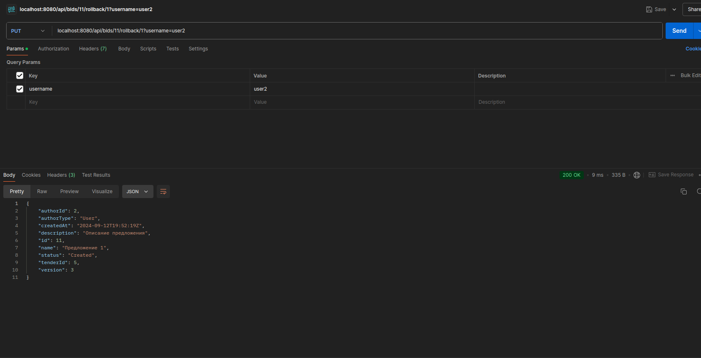

## Пожалуйста, обратите внимание:
Были внесены незначительные измененя в спецификацию:
 - Тип параметра id был изменён с uuid на integer. (в примерах испольуется integer, однако в спецификации тип string).  
 - Endpoint **/bids/{tenderId}/reviews** был заменён на **/bids-tender/{tenderId}/reviews** (по причине конфлита маршрутов).  
 - Endpoint **/bids/{tednerId}/list** был заменён на **/bids-tender/{tednerId}/list** (по причине конфликта маршрутов).  
 - Спецификация доступна по адресу: (https://git.codenrock.com/avito-testirovanie-na-backend-1270/cnrprod1725722009-team-78107/zadanie-6105/-/blob/master/pkg/protocol/oapi/openapi.yml?ref_type=heads)  


# Запуск  

1. Сколнировать репозиторий:
```bash   
git clone https://github.com/MaksimovDenis/zadanie-6105.git
```
2. Перейти в директорию проекта (если Вы не в ней).  

3. Из дериктории проекта выполнить команды:  
```bash      
docker compose up --build 
```
4. Остановка  
```bash      
docker compose down
```
5. Запуск линтера (из дериктории проекта)
```bash
golangci-lint run -c .golangci.yml
```
P.S. Миграции таблиц накатываются автоматически. Т.к. конкретных методов для добавления пользователей в задание не было, добавил тестовые данные:  
```bash      
INSERT INTO employee (username, first_name, last_name)
VALUES
    ('user1', 'Denis', 'Maksimov'),
    ('user2', 'Margot', 'Robbie'),
    ('user3', 'Jennifer', 'Lawrence');

INSERT INTO organization (name, description, type)
VALUES
    ('TechCorp', 'A technology company', 'LLC'),
    ('FinServices', 'Financial services provider', 'JSC'),
    ('HealthInc', 'Healthcare and wellness', 'IE');

INSERT INTO organization_responsible (organization_id, user_id)
VALUES
    (1, 1),
    (1, 2), 
    (2, 3);
```

# Реализация  
- Подход с чистой архитектурой  
- Язык программирование: Golang 1.22.4  
- Для реализации http сервера использовалась библиотека gin.
- Кодогенерация oapi-codegen (https://git.codenrock.com/avito-testirovanie-na-backend-1270/cnrprod1725722009-team-78107/zadanie-6105/-/blob/master/pkg/protocol/oapi/openapi.yml?ref_type=heads)
- Запросы к БД - sqlc 
- Линитер golangci-lint:  

# Некоторые примеры запросов 
 - Эндпоинт: **GET /ping**  
     
 - Эндпоинт: **GET /api/tenders**  
     
 - Эндпоинт: **GET /api/tenders/new**  
     
 - Эндпоинт: **GET /api/tenders/new**  
     
 - Эндпоинт: **PATCH /api/tenders/{tenderId}/edit**  
     
 - Эндпоинт: **PUT /api/tenders/{tenderId}/rollback/{verrsion}**  
     
 - Эндпоинт: **POST /api/bids/new**    
     
 - Эндпоинт: **GET /api/bids-tender/{tenderId}/list**  
      
 - Эндпоинт: **PATCH /api/bids/{tenderId}/edit**   
      
 - Эндпоинт: **PUT /api/bids/{bidsId}/rollback/{version}**   
     
 - Эндпоинт: **PUT /api/bids/{bidsId}/feedback**  
      
 - Эндпоинт: **PUT /api/bids-tender/{tenderId}/reviews**   
    

# Что следует улучшить  
- Были реализованы все методы, возможны ошибки в логике, если я не верно понял какие-то пункты задания.  
- Стоит улучшить систему валидации полей, основные сценарии учтены, но не все.  
- Необходимо улучшить систему обработки всех возможных ошибок.  
- Нужно прикрутить авторизацию и аутентификацию с refresh и access токенами.   
